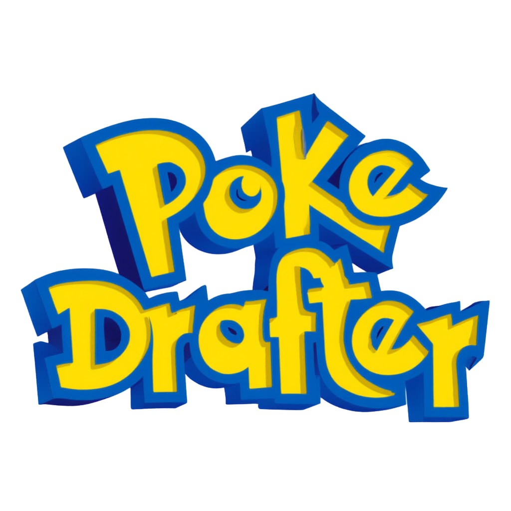
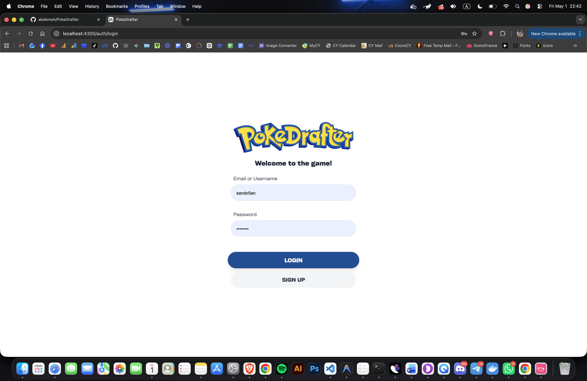
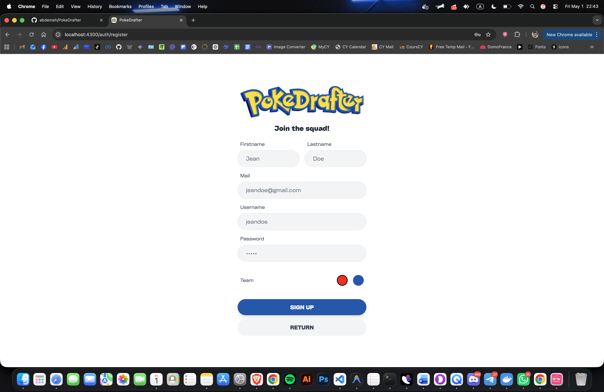
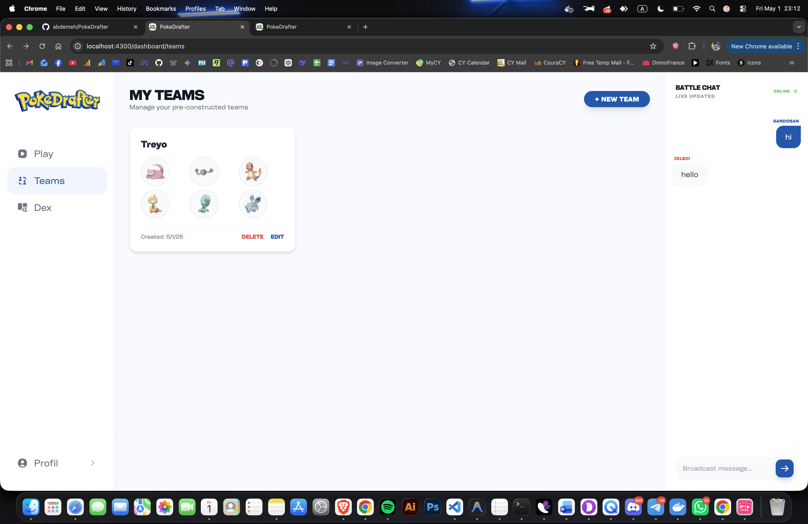
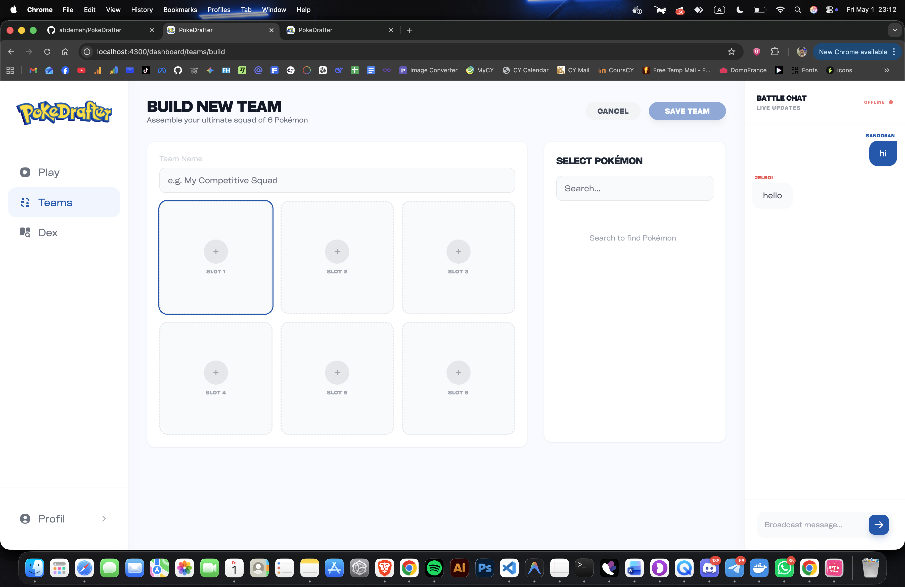
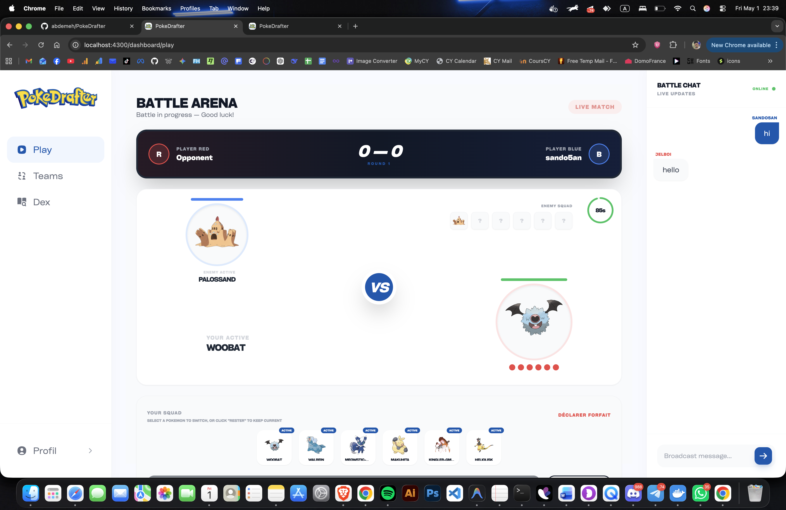
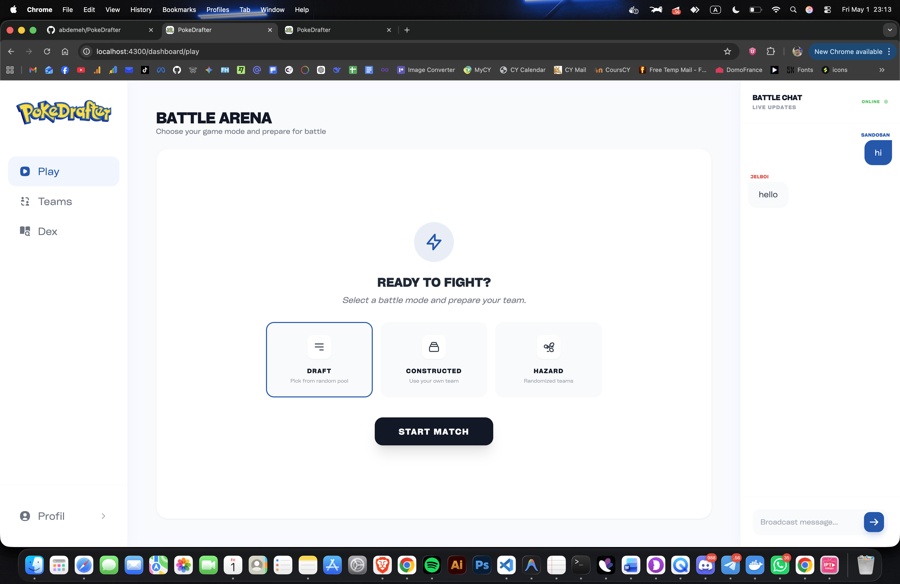

<p align="center">
  
</p>

<h1 align="center">PokeDrafter</h1>

<p align="center">
  <strong>A high-fidelity, real-time multiplayer Pokémon strategy game built on a microservices architecture.</strong>
</p>

<p align="center">
  
  
  
  
  
</p>

---

## 🌟 Overview

PokeDrafter is a competitive Pokémon battle platform where players engage in strategic turn-based combat. The game engine implements a strict advantage formula $F(A)$ to determine the outcome of matchups based on type advantages, providing a deep and balanced gameplay experience.

### The $F(A)$ Engine
Match outcomes are calculated using the following Advantage Formula:
$$F(A) = 1 \cdot \frac{W}{Y} \cdot \frac{W}{Z} + 1 \cdot \frac{X}{Y} \cdot \frac{X}{Z}$$
Where $W, X$ are attacking types and $Y, Z$ are defending types.

---

## 📸 Visual Gallery

### Authentication & Dashboard
| Login | Registration |
| :---: | :---: |
|  |  |

### Team Management
| Team List | Team Builder |
| :---: | :---: |
|  |  |

### Battle Arena
| Mode Selection | Battle Field |
| :---: | :---: |
|  |  |

### Pokedex


---

## 🎮 Game Modes

1.  **Draft Mode (Pioche)**: Players alternate picks from a randomized 12-Pokémon pool to build their 6-man squad in real-time.
2.  **Constructed Mode (Construit)**: Bring your own custom-built teams from the Team Builder into the arena.
3.  **Hazard Mode (Hasard)**: Pure chaos. Both players receive completely randomized teams, and the opponent's Pokémon remain hidden until they are revealed in battle.

---

## 🚀 Key Features

- **Real-Time Multiplayer**: Built with WebSockets and Kafka for instantaneous move resolution and chat.
- **Global Battle Chat**: Integrated sidebar that tracks the "Battle Log" and allows players to communicate across all views.
- **AI-Powered Team Builder**: Stuck on a team? Use the **"AI Complete"** feature to automatically fill empty slots with recommended Pokémon.
- **Microservices Architecture**: Completely decoupled services for horizontal scalability.

---

## 🏗️ Architecture

```text
PokeDrafter/
├── web/              # Angular 17+ Frontend
├── api/              # Python FastAPI Microservices
│   ├── auth_service/       # JWT Auth & User Profiles
│   ├── team_service/       # Team CRUD & AI Recommender
│   ├── battle_service/     # Battle Engine & Kafka Producer
│   ├── pokedex_service/    # PokéAPI Proxy & Redis Caching
│   ├── chat_service/       # Real-time WebSocket Gateway
│   └── gateway/            # Nginx Reverse Proxy
├── infra/            # Deployment (Docker, K8s)
└── docs/             # Media & Technical Specs
```

---

## ⚙️ Quick Start

### 1. Launch Services (Docker)
```bash
cd infra/docker
docker-compose up --build -d
```

### 2. Launch Frontend
```bash
cd web
npm install
npm start -- --port 4300
```

### 3. Access
- **App**: `http://localhost:4300`
- **Gateway**: `http://localhost:80`
- **API Docs**: `http://localhost:80/docs`

---

## 👥 Credits & License
Developed for the **ING3 Microservices Module (ICC) — 2026**. 
Powered by [PokéAPI](https://pokeapi.co/).
