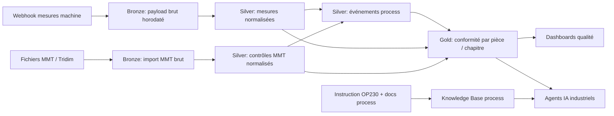

# Rapport de cadrage

## Organisation et agrégation des données FAMAT pour alignement avec la future plateforme IA

Date: 2026-06-18

---

## 1. Résumé exécutif

Le socle de données FAMAT est déjà très prometteur pour des usages IA industriels: on observe des mesures machine détaillées, des informations de chapitres de fabrication, des données de contrôle tridimensionnel (MMT), et une logique métier exprimée dans les documents de contexte.

Le principal enjeu n'est pas le volume, mais la structuration: aujourd'hui, les données sont exploitables, mais dispersées entre payloads webhook, fichiers historiques, mappings partiels et documents de procédure. Pour être pleinement aligné avec une plateforme IA d'entreprise, il faut passer d'un mode fichier/payload à un mode produit de données gouverné, traçable et interrogeable.

Recommandation clé: mettre en place un modèle en 3 couches (Bronze/Silver/Gold), un dictionnaire métier versionné, et un pipeline de qualité des données orienté process (tolérances, reprises opérateur, fin de cycle), puis connecter ce socle à la couche RAG/agents de la plateforme IA.

---

## 2. Périmètre analysé

Sources principales analysées:

- Platforme_IA/FAMAT-Analyse fabrication.docx
- Platforme_IA/Instruction de travail OP230.pdf
- Platforme_IA/FAMAT/2025_11 - Analyse data conformité pièces/Payload-20260526.csv
- Platforme_IA/FAMAT/2025_11 - Analyse data conformité pièces/Historique/TCF-cylene-equivalent-machine-tridim.CSV
- Platforme_IA/FAMAT/2025_11 - Analyse data conformité pièces/Historique/2521M71G12_TCF_01700_00_CA449510-FRZCR196_2-136-3-2158-00-000_4_20251113_13.12.40_tfm4(5).txt
- Platforme_IA/FAMAT/2025_11 - Analyse data conformité pièces/Test LLM SQL/Famat SQL.ipynb
- Platforme_IA/chatcanalllm.txt
- Platforme_IA/Analyse préalable/ragflow_stack_bodemer.md

Constats issus du corpus:

- Données machine: structure type Serial, Chapter, cle, value, timestamp de réception.
- Données MMT: présence de toleranceMin, toleranceMax, valueTheorique, valeur mesurée, correspondance chapitre.
- Sémantique process explicite: chapitres 0-32 (calibrage/ébauche), retour chapitre 1 en cas de reprise manuelle, chapitre 33-fin (finitions/contrôle final/fin de cycle).
- Premiers tests IA/SQL existants, donc maturité initiale sur la consommation IA.

---

## 3. Diagnostic de maturité data

### Forces

- Granularité fine des mesures par chapitre et clé.
- Horodatage disponible.
- Mapping machine-MMT amorcé.
- Données déjà mobilisées dans des expérimentations LLM SQL.

### Faiblesses

- Schéma logique non stabilisé (payload JSON dans un CSV, dictionnaire implicite).
- Mélange entre données techniques, métier et commentaires opérateurs dans des formats hétérogènes.
- Gestion des doublons et des reprises non industrialisée.
- Pas de couche sémantique centrale (ontology/canonical model).
- Faible séparation entre données brutes, données nettoyées et indicateurs décisionnels.

### Risques pour la future plateforme IA

- Hallucinations ou réponses inexactes des agents si dictionnaire des clés incomplet.
- Analyses biaisées si les reprises opérateur (retour chapitre 1) ne sont pas modélisées comme événements.
- Difficulté à tracer une recommandation IA jusqu'à la donnée source (problème d'auditabilité qualité).

---

## 4. Modèle cible d'organisation des données

### 4.1 Principe directeur

Créer un Data Product FAMAT orienté qualité process, composé de:

- tables de faits temporelles,
- dimensions de référence (machine, opération, clé, pièce, tolérance),
- événements process (reprise, recalage, fin de cycle, non-conformité),
- vues analytiques pour IA et pilotage usine.

### 4.2 Schéma conceptuel

### 4.3 Couche Bronze

Objectif: ne rien perdre.

- Stockage brut des payloads webhook (JSON intact + métadonnées ingestion).
- Stockage brut MMT/tridim (fichiers et lignes source).
- Ajout des métadonnées techniques: source_file, ingestion_ts, hash_ligne, version_parser.

### 4.4 Couche Silver

Objectif: normaliser, fiabiliser, relier.

Objets recommandés:

- fact_machine_mesure
  - mesure_id
  - serial_piece
  - chapter
  - cle_mesure
  - value_num
  - unit
  - event_ts
  - is_rework_cycle
  - source_record_id

- fact_mmt_controle
  - controle_id
  - serial_piece
  - cle_mesure
  - tolerance_min
  - tolerance_max
  - value_theorique
  - value_mesuree
  - chapter_mappe
  - event_ts

- dim_cle_mesure
  - cle_mesure
  - famille (calage, jauge, centrage, correction, etc.)
  - description_metier
  - unite_attendue
  - criticite_qualite

- fact_evenement_process
  - serial_piece
  - type_evenement (debut_cycle, retour_chap1, reprise_operateur, fin_cycle)
  - chapter_contexte
  - event_ts
  - payload_contexte

### 4.5 Couche Gold

Objectif: décision et IA fiable.

Vues recommandées:

- vw_conformite_piece_cycle
  - score_conformite global
  - nb_mesures_hors_tolerance
  - nb_reprises
  - temps_cycle
  - statut_liberation

- vw_drift_machine_par_chapitre
  - dérive moyenne par clé critique
  - tendance temporelle
  - seuil d'alerte

- vw_explications_ia_prêtes
  - agrégats interprétables par agent
  - features prêtes pour génération d'explications

---

## 5. Agrégation: logique métier recommandée

### 5.1 Clé d'agrégation

Niveau recommandé: Serial + cycle process + chapter + cle_mesure.

Pourquoi:

- permet l'analyse intra-pièce,
- garde la chronologie de cycle,
- distingue les reprises opérateur,
- permet la jointure fine avec la MMT.

### 5.2 Détection de cycle et reprises

Règle proposée:

- un cycle démarre au premier événement chapter 0 ou premier événement de la pièce,
- un retour vers chapter 1 après chapter >= 33 déclenche un événement reprise_operateur,
- un cycle se termine sur événement de fin défini par OP230 (ou heuristique de silence + chapitre final).

### 5.3 Agrégats minimaux à produire

- moyenne, min, max, écart-type par cle_mesure/chapter/cycle,
- delta versus valueTheorique,
- indicateur within_tolerance,
- ratio hors tolérance par pièce,
- temps entre chapitres,
- nombre de corrections successives avant conformité.

---

## 6. Alignement avec la future plateforme IA

Le document d'architecture RAG de la plateforme IA (RAGFlow/Infinity/PostgreSQL/Valkey/vLLM) est cohérent avec ce besoin, mais nécessite une séparation claire entre:

- base analytique structurée (SQL/warehouse) pour calcul fiable,
- knowledge base documentaire (OP230, standards, commentaires experts) pour contextualisation.

Recommandation d'alignement:

- Les calculs de conformité doivent être effectués côté SQL/Gold, jamais laissés au LLM.
- Le LLM/agent ne fait que:
  - générer des requêtes contrôlées,
  - expliquer des résultats déjà calculés,
  - proposer des causes probables basées sur docs + historiques.

Pattern cible:

1. question opérateur,
2. requête SQL paramétrée sur tables Gold,
3. récupération de règles OP230 pertinentes via RAG,
4. réponse argumentée et traçable (valeurs + tolérances + règle process).

---

## 7. Gouvernance et qualité des données

### 7.1 Data contracts à formaliser

- Contrat webhook machine:
  - champs obligatoires: Serial, Chapter, cle, value, timestamp_source
  - types stricts
  - unités explicites

- Contrat MMT:
  - toleranceMin/Max numériques,
  - valueTheorique obligatoire,
  - mapping chapter obligatoire.

### 7.2 Règles de qualité prioritaires

- unicité fonctionnelle de la mesure (serial, chapter, cle, event_ts arrondi),
- validité numérique de value,
- liste blanche des clés autorisées,
- détection d'incohérences d'unités,
- détection des trous temporels anormaux,
- complétude minimale par chapitre critique.

### 7.3 Traçabilité / audit

Pour chaque KPI et chaque réponse IA, conserver:

- source des lignes utilisées,
- version du modèle de transformation,
- version du dictionnaire métier,
- version de l'instruction OP230 utilisée.

---

## 8. Cas d'usage IA à forte valeur

### Priorité 1 (court terme)

- Assistant qualité: expliquer pourquoi une pièce est hors tolérance.
- Copilote process: identifier les chapitres avec dérive récurrente.
- Q&A SQL métier sécurisé sur les vues Gold.

### Priorité 2 (moyen terme)

- Pré-alerte de non-conformité avant fin de cycle.
- Recommandation de réglage à partir de patterns historiques similaires.
- Analyse automatique des reprises opérateur et de leur efficacité.

### Priorité 3 (plus avancé)

- Simulation contrefactuelle: impact d'un réglage hypothétique.
- Détection d'anomalies multivariées temps réel.

---

## 9. Roadmap proposée

### Phase 0 (2-3 semaines) - Cadrage data product

- figer le dictionnaire des clés de mesure,
- définir les unités et familles métier,
- formaliser les événements process (dont reprise chapitre 1),
- définir les KPI Gold cibles.

### Phase 1 (4-6 semaines) - Industrialisation Bronze/Silver

- ingestion automatisée webhook + MMT,
- normalisation typée,
- règles de qualité automatiques,
- historisation et traçabilité.

### Phase 2 (4-6 semaines) - Gold + IA explicable

- construction des vues Gold conformité,
- exposition API SQL sécurisée,
- intégration RAG OP230 + documentation process,
- agent QA métier avec citations et preuves.

### Phase 3 (continu) - Optimisation

- boucle d'amélioration avec experts atelier,
- monitoring des performances IA,
- extension à d'autres références pièces et lignes.

---

## 10. KPI de réussite

- réduction du temps d'analyse d'une non-conformité,
- baisse du taux de rebut/reprise,
- part de réponses IA validées sans correction humaine,
- taux de traçabilité complète des réponses IA,
- stabilité des pipelines (fraîcheur, complétude, qualité).

---

## 11. Recommandations concrètes immédiates

1. Créer un dictionnaire officiel des clés cle (82+ valeurs) avec unité, criticité et description métier.
2. Modéliser explicitement le concept de cycle de fabrication et reprise opérateur.
3. Mettre les calculs de conformité dans SQL (Silver/Gold), pas dans les prompts LLM.
4. Construire une vue Gold unique par pièce/cycle qui devienne la source de vérité des dashboards et agents.
5. Versionner et indexer OP230 dans la knowledge base pour réponses IA contextualisées et auditables.

---

## 12. Points d'attention OP230

L'instruction de travail OP230 doit être transformée en objets exploitables machine:

- étapes opératoires normalisées,
- seuils de contrôle et décisions associées,
- règles d'acceptation/rejet,
- exceptions autorisées,
- actions de reprise.

Format cible recommandé:

- une table regle_process_op230 versionnée,
- une table mapping_regle_vers_chapter,
- une table preuve_application_regle par cycle.

---

## 13. Conclusion

Le potentiel IA est déjà présent dans les données FAMAT. Le levier principal pour réussir l'alignement avec la plateforme IA de l'entreprise est une architecture data robuste qui sépare clairement:

- collecte brute,
- normalisation métier,
- indicateurs décisionnels,
- explicabilité IA via documentation process.

Avec cette approche, l'IA devient un accélérateur fiable du process qualité, plutôt qu'un simple chatbot sur des données hétérogènes.

---

## 14. Proposition d'arborescence cible

Arborescence recommandée dans le workspace (vision data product):

- Platforme_IA/FAMAT/
  - 00_governance/
    - dictionnaire_cles_mesure.csv
    - data_contract_webhook_machine.md
    - data_contract_mmt.md
    - op230_versioning.md
  - 01_bronze/
    - webhook_machine/
      - annee=YYYY/mois=MM/jour=DD/
    - mmt_tridim/
      - annee=YYYY/mois=MM/jour=DD/
    - op230_documents/
  - 02_silver/
    - fact_machine_mesure/
    - fact_mmt_controle/
    - fact_evenement_process/
    - dim_cle_mesure/
  - 03_gold/
    - vw_conformite_piece_cycle/
    - vw_drift_machine_par_chapitre/
    - vw_explications_ia_pretes/
  - 04_ai/
    - prompts_guardrails/
    - sql_templates_valides/
    - rag_sources_index/
  - 05_monitoring/
    - qualite_donnees/
    - usage_agents/
    - performance_pipelines/

Conventions de nommage:

- horodatage en UTC ISO8601,
- clés techniques en snake_case,
- partitionnement minimal par date d'événement,
- version explicite dans les objets de règles process (op230_vX_Y).
